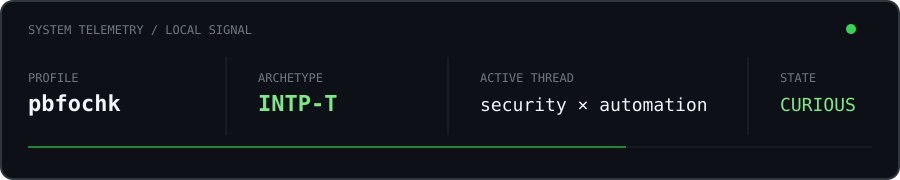

<div align="center">
  
</div>
<br>

<div align="center">

`security` &nbsp;·&nbsp; `automation` &nbsp;·&nbsp; `systems` &nbsp;·&nbsp; `ideas`

</div>

```yaml
mind:
  mode:        "question → model → experiment → rebuild"
  bias:        "first principles over familiar answers"
  interests:   [security, automation, new ideas, elegant tools]
  status:      "quietly turning curiosity into code"
```

## 01 / Operating principles

> I like systems with hidden depth, tools that feel inevitable,
> and ideas that make the familiar look strange again.

- Break things down until the mechanism becomes obvious.
- Automate repetition; keep the interesting problems human.
- Prefer a small, sharp tool to a large, vague solution.
- Stay curious enough to change the model.

## 02 / Current signals

```text
security research   ━━━━━━━━━━━━━━━━━━━━  active
automation          ━━━━━━━━━━━━━━━░░░░░  building
open source         ━━━━━━━━━━━░░░░░░░░░  exploring
new ideas           ∞                     always
```

## 03 / Instruments

<div align="center">
  
</div>

## 04 / Telemetry

<div align="center">
  
</div>

<div align="center">
  
</div>

<details>
<summary><code>menu / cognitive-pattern</code></summary>

```text
type      INTP
input     questions, patterns, contradictions
process   observe → abstract → test → refine
output    a quieter, clearer model
```

</details>

<br>

<div align="center">
  <sub>「理解世界的方式，是拆开它，再用自己的方式重新组合。」</sub>
  <br><br>
  
</div>
