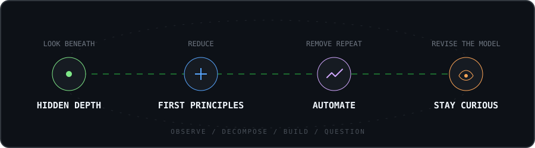

<div align="center">
  
</div>
<br>

<div align="center">

`security` &nbsp;·&nbsp; `automation` &nbsp;·&nbsp; `systems` &nbsp;·&nbsp; `ideas`

</div>

```yaml
mind:
  mode:        "question → model → experiment → rebuild"
  bias:        "first principles over familiar answers"
  interests:   [security, automation, new ideas, elegant tools]
  status:      "quietly turning curiosity into code"
```

## 01 / Operating principles

<div align="center">
  
</div>

## 02 / Current signals

```text
security research   ━━━━━━━━━━━━━━━━━━━━  active
automation          ━━━━━━━━━━━━━━━░░░░░  building
open source         ━━━━━━━━━━━░░░░░░░░░  exploring
new ideas           ∞                     always
```

## 03 / Instruments

<div align="center">
  
</div>

## 04 / Projects

<details open>
<summary><code>proxy-pool</code> — 免费代理池 · 常驻服务 + mubeng 轮换网关</summary>

```text
stack       python3 · bash · mubeng · systemd
purpose     爬取公开免费代理 → 并发校验 → HTTP API 取用
            + 本地轮换网关 (127.0.0.1:10888) 自动换出口 IP
status      live
```

[`pbfochk/proxy-pool`](https://github.com/pbfochk/proxy-pool) — crawl · validate · serve · rotate

</details>

## 05 / Telemetry

<div align="center">
  
</div>

<div align="center">
  
</div>

<details>
<summary><code>menu / cognitive-pattern</code></summary>

```text
type      INTP
input     questions, patterns, contradictions
process   observe → abstract → test → refine
output    a quieter, clearer model
```

</details>

<br>

<div align="center">
  <sub>「理解世界的方式，是拆开它，再用自己的方式重新组合。」</sub>
  <br><br>
  
</div>
